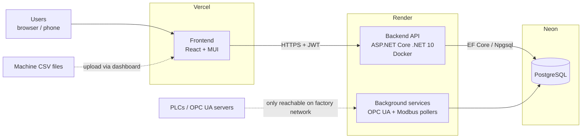

# OEE Dashboard

A web application for tracking **OEE (Overall Equipment Effectiveness)** of production machines, with maintenance, breakdown and continuous-improvement (PDCA / 8D) tools for the shop floor.

**Live app:** https://oee-dashboard-lime.vercel.app
**API:** https://oee-dashboard-36c9.onrender.com

---

## 1. Architecture



| Layer | Technology | Hosted on | Plan |
|---|---|---|---|
| Frontend | React 19, Material UI 9, Recharts, Create React App | **Vercel** | Free (Hobby) |
| Backend API | ASP.NET Core minimal API, .NET 10, C# | **Render** (Docker web service, Singapore) | Free |
| Database | PostgreSQL | **Neon** (ap-southeast-1, Singapore) | Free |
| Source code | Git | **GitHub** – `amirul12054/oee-dashboard` | Public |

Every push to the `main` branch on GitHub redeploys **both** Vercel (frontend) and Render (backend) automatically.

> **History:** the backend and database were originally on Railway. After the Railway trial expired (Oct 2026) they were moved to Render + Neon. All data was re-created from scratch.

---

## 2. Repository structure

```
oee-dashboard/
├── README.md                     ← this file
├── .gitignore
└── OeeApi/                       ← BACKEND (Render root directory)
    ├── Dockerfile                ← how Render builds/runs the API
    ├── .dockerignore
    ├── OeeApi.csproj             ← .NET project + NuGet packages
    ├── Program.cs                ← app startup + ALL API endpoints
    ├── OeeDbContext.cs           ← EF Core database context (list of tables)
    ├── OeeDbContextFactory.cs    ← design-time context for `dotnet ef` (local DB only)
    ├── *Entity.cs                ← one file per database table (see §4)
    ├── ShiftCalendar.cs          ← decides which shift a timestamp belongs to
    ├── LiveReadingProcessor.cs   ← turns live PLC samples into OEE readings
    ├── OpcUaPollingService.cs    ← background job: polls OPC UA machines
    ├── ModbusPollingService.cs   ← background job: polls Modbus TCP machines
    ├── Migrations/               ← old EF Core migrations (see §7)
    ├── simulate_*.py             ← test data simulators (see §8)
    └── oee-dashboard/            ← FRONTEND (Vercel root directory)
        ├── package.json
        ├── public/
        └── src/
            ├── config.js             ← API_URL (points to Render)
            ├── index.tsx             ← React entry point
            ├── App.jsx               ← main dashboard, login state, navigation
            ├── Login.jsx             ← sign-in page
            ├── OeeCharts.jsx         ← OEE trend charts (date range + shift filter)
            ├── CsvImport.jsx         ← 3-step CSV import wizard
            ├── AdminPanel.jsx        ← users, machines, contacts, products
            ├── ShiftCalendarPanel.jsx← shifts and holidays setup
            ├── MaintenanceTab.jsx    ← breakdowns, PM schedules, 8D reports
            ├── PdcaTab.jsx           ← PDCA improvement tracking
            ├── ProfilePage.jsx       ← own profile + change password
            ├── InfoTip.jsx           ← small (i) tooltip helper
            ├── Register.jsx          ← (not connected – no backend endpoint)
            ├── ForgotPassword.jsx    ← (not connected – no backend endpoint)
            └── ShiftFilter.jsx       ← (old, commented out)
```

---

## 3. How OEE is calculated

For each reading (one row = one shift of one machine):

| Metric | Formula |
|---|---|
| Availability | Run Time ÷ Planned Time |
| Performance | Actual Rate ÷ Ideal Rate |
| Quality | Good Units ÷ Total Units |
| **OEE** | Availability × Performance × Quality |

- Changeover time is stored separately and is **not** part of Run Time.
- Target OEE shown on the dashboard is **85%**.
- Shifts: if no shifts are configured in Admin, the default is **Morning 06:00–18:00** and **Night 18:00–06:00**.

---

## 4. Database (PostgreSQL on Neon)

Tables are created automatically when the API starts (`EnsureCreated()` in `Program.cs`) and an `admin` user is created if the Users table is empty.

| Table | Entity file | Purpose |
|---|---|---|
| Users | `UserEntity.cs` | Login accounts and roles |
| Machines | `MachineEntity.cs` | Machines + connection settings (CSV / OPC UA / Modbus) |
| OeeReadings | `OeeReadingEntity.cs` | One OEE record per machine per shift |
| Products | `ProductEntity.cs` | Products/SKUs with their own ideal rate |
| ShiftDefinitions | `ShiftDefinitionEntity.cs` | Configurable shifts |
| Holidays | `HolidayEntity.cs` | Factory or machine holidays |
| Breakdowns | `BreakdownEntity.cs` | Breakdown tickets |
| BreakdownAssignees | `BreakdownAssigneeEntity.cs` | Who is assigned to a breakdown |
| Contacts | `ContactEntity.cs` | Technician / engineer name cards |
| EightDReports | `EightReportEntity.cs` | 8D problem-solving reports |
| PmSchedules / PmCompletions | `PmScheduleEntity.cs`, `PmCompletionEntity.cs` | Preventive maintenance plan + history |
| Pdca | `PdcaEntity.cs` | PDCA improvement items |
| VerificationCodes | `VerificationCodeEntity.cs` | (unused – for planned email verification) |

---

## 5. API endpoints (Program.cs)

All endpoints except login require a JWT token (`Authorization: Bearer …`).

| Area | Endpoints |
|---|---|
| Auth | `POST /auth/login`, `POST /auth/change-password` |
| Users | `GET /users`, `PUT /users/profile` |
| Admin – users | `GET/POST /admin/users`, `PUT /admin/users/{id}/role`, `POST /admin/users/{id}/reset-password`, `DELETE /admin/users/{id}` |
| Machines | `GET /machines`, `POST/PUT /admin/machines`, `DELETE /admin/machines/{id}`, `PUT /machines/{id}/current-product`, `GET /machines/{id}/history` |
| OEE data | `GET /oee-readings`, `POST /import/preview`, `POST /import/process` |
| Shifts / holidays / products | `GET /shifts`, `/admin/shifts`, `GET /holidays`, `/admin/holidays`, `GET /products`, `/admin/products` |
| Maintenance | `/breakdowns`, `/breakdowns/{id}/assignees`, `/8d-reports`, `/pm-schedules`, `/maintenance/summary` |
| Improvement | `/pdca`, `/contacts` |
| Legacy setup / debug | `/setup-*` (old one-off schema fixes, no longer needed), `/debug-readings` |

---

## 6. User roles

| Role | Can do |
|---|---|
| **admin** | Everything: users, machines, shifts, products, holidays, CSV import |
| **engineer** | Manage machines and contacts, CSV import, view all dashboards |
| **technician / operator** | View dashboards and charts, breakdowns, PM, PDCA |

**Adding a user:** Admin panel → Add User. The first password is the **same as the username**; the user should change it in Profile. "Reset password" sets it back to the username.

---

## 7. Deployment & configuration

### Backend – Render
- Service type: **Web Service**, Language: **Docker**, Root Directory: `OeeApi`, Region: Singapore, Instance: Free
- Builds with `OeeApi/Dockerfile` (.NET 10 SDK → ASP.NET runtime image), listens on `PORT` (default 8080)
- Environment variables (set in Render → service → **Environment**):

| Key | Description |
|---|---|
| `ConnectionStrings__DefaultConnection` | Neon connection string in .NET format: `Host=…;Database=neondb;Username=…;Password=…;SSL Mode=Require` |
| `Jwt__Key` | Secret for signing login tokens (32+ characters) |
| `Jwt__Issuer` | `OeeApi` |
| `Jwt__Audience` | `OeeDashboard` |
| `ADMIN_PASSWORD` | Password for the auto-created `admin` user (only used when the DB has no users) |

> Never commit these values to GitHub.

### Frontend – Vercel
- Root directory: `OeeApi/oee-dashboard`, framework: Create React App
- The API address is set in `src/config.js` → change it here if the backend URL changes.

### Database – Neon
- Project `oee-dashboard`, branch `production`, database `neondb`
- Use the **direct** (non-pooler) connection string, converted to .NET format.

### Free-plan limits
- Render free service **sleeps after ~15 min idle**; the first request after that takes ~50 s.
- Background OPC UA / Modbus pollers stop while Render sleeps, and a cloud server **cannot reach PLCs on the factory network** anyway. For live machine data, run the API on a PC inside the factory network or push data from Ignition.
- Neon free: 0.5 GB storage.

### Migrations note
The `Migrations/` folder is out of date (it only covers the original 8 tables). The live database is created with `EnsureCreated()` instead. If you want to go back to EF migrations later, create a fresh baseline migration first.

---

## 8. Getting data in

### CSV import (main method)
Dashboard → **Import CSV** → upload → pick machine → map columns → Import.

Expected columns (names can differ, you map them in the wizard):

| Field | Example | Required |
|---|---|---|
| Date/Time | `2026-09-09 06:00:00` (use `yyyy-MM-dd HH:mm:ss`) | ✔ |
| Planned Time (min) | `660` | ✔ |
| Run Time (min) | `625` | ✔ |
| Ideal Rate (units/h) | `120` | ✔ |
| Actual Rate (units/h) | `108` | ✔ |
| Total Units | `1125` | ✔ |
| Good Units | `1103` | ✔ |
| Product / SKU | `PCB-A100` (auto-created if new) | optional |
| Changeover (min) | `30` | optional |

Rules: plain comma-separated values, **no commas or quotes inside values**, numbers only in numeric columns. Each file is imported into **one** machine. Importing the same file twice duplicates the data.

### Live data (OPC UA / Modbus TCP)
Set the machine's Data Connection Type in Admin. The background services poll every 10 s and save a reading every `SnapshotIntervalMinutes`.

### Simulators (`OeeApi/simulate_*.py`, run locally with Python)
| Script | Purpose |
|---|---|
| `simulate_csv.py` / `simulate_csv_file_only.py` / `simulate_csv_autoimport.py` | Generate machine CSV output files |
| `simulate_opcua.py` | Fake OPC UA server (`pip install opcua`) |
| `simulate_modbus.py` | Fake Modbus TCP server (`pip install pymodbus`) |

---

## 9. Running locally

**Backend**
```bash
cd OeeApi
# create OeeApi/appsettings.json (git-ignored) with ConnectionStrings + Jwt values, or set env vars
dotnet run
```

**Frontend**
```bash
cd OeeApi/oee-dashboard
npm install
npm start          # http://localhost:3000
```
For local testing, temporarily set `src/config.js` to `http://localhost:8080`.

---

## 10. Updating the app

```bash
git pull                       # get latest changes
# ...edit code...
git add .
git commit -m "describe change"
git push                       # Vercel + Render redeploy automatically
```
Small edits can also be done directly on github.com (pencil icon → Commit changes).

---

## 11. Known issues / to-do
- `Register` and `Forgot password` pages exist in the frontend but have no backend endpoints.
- `/setup-*` and `/debug-readings` endpoints are leftovers and should be removed or protected.
- `OeeDbContextFactory.cs` contains a hard-coded local DB password – move it to an environment variable.
- New users' default password equals their username – ask users to change it immediately.
- CSV import has no duplicate check and no "undo".
